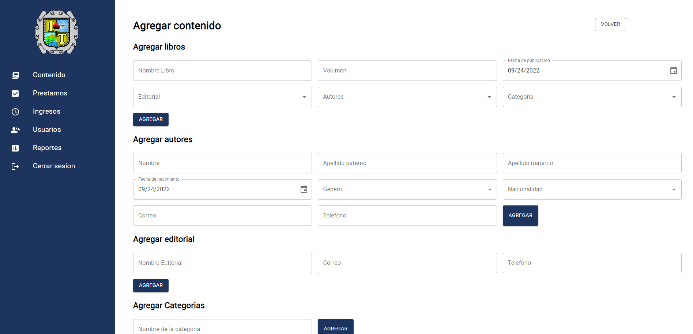
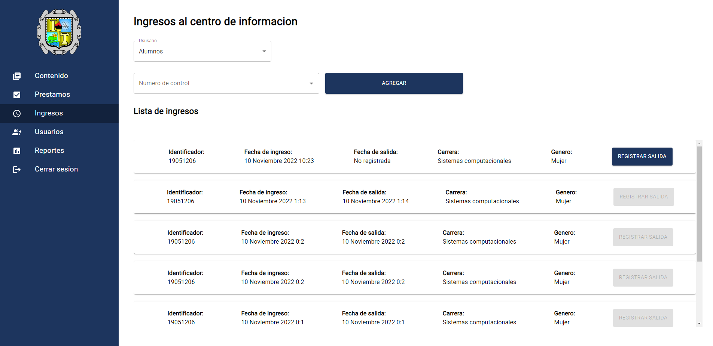
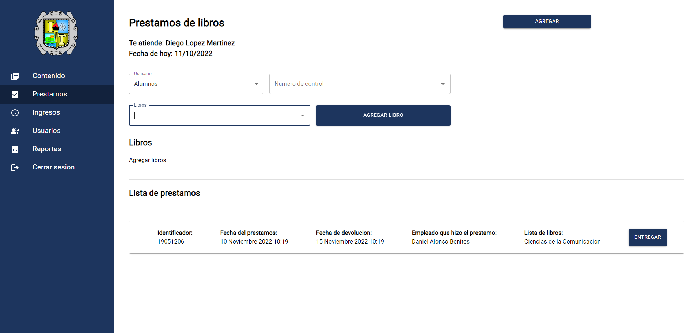
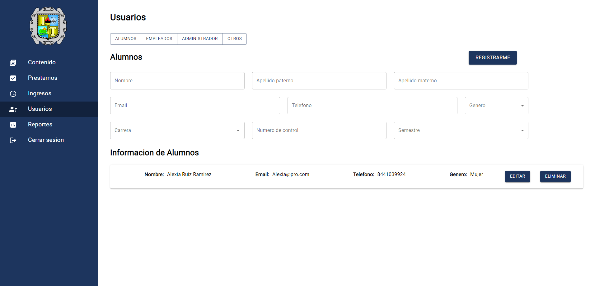
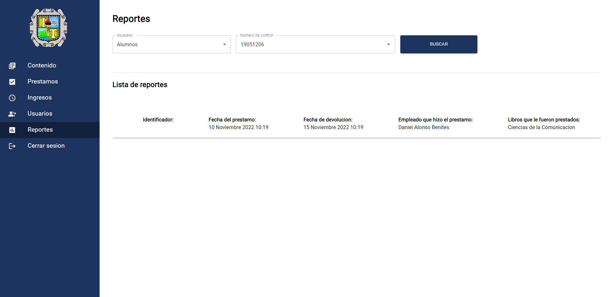

# Aplicacion para administracion del centro de informacion del Instituto tecnologico de Saltillo

## Propósito 

Este proyecto fue hecho para optimizar el registro, entradas y prestamos al centro de informacion.
Esto fue desarrollado para la materia de administracion de base de datos

## Evidencias

### Login

  

### Ver contenido

  

### Registrar contenido

  

### Registrar entradas

  

### Registrar prestamos

  

### Leer y registrar ususarios

  

### Reportes de prestamos

  

